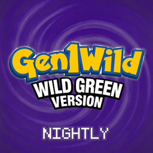

<p align="center">
  
</p>

# Gen1NightlyMods

**The nightly channel for [Wild Green][cart].** This is where changes are
written and tested before they reach the cart everybody else is playing.

The stable cart does not move. [Wild Green][cart] stays exactly where it is,
pinned to released mods, and nothing here can reach it — every mod in this
repository installs under an id of its own and **conflicts with its stable
twin on purpose**. Run one or the other, never both; your save, your settings
and your cartridge are untouched either way.

Nightlies are listed in [Gen1NightlyIndex][index]. Add that index in the game
under **MODS > FIND MODS** and the nightly cart and its mods show up beside the
stable ones, with `NIGHTLY` on the cartridge and a dark purple shell so you can
tell at a glance which one you are opening.

## What is in it

| | What it is | Forked from |
|---|---|---|
| **[Wild Green Nightly](mods/wild_green_nightly)** | the player in green, the names, and `WILD GREEN VERSION` on the title screen | [Gen1MakeItGreen][green] |
| **[Gen1WildUI Nightly](mods/gen1_wild_ui_nightly)** | the visual half of the suite: backdrops, battle menus, the Pokédex, the box, the party menu, the bag, the mod manager — and `UI THEME` | [Gen1WildUI][ui] |
| **[Gen1WildQOL Nightly](mods/gen1_wild_qol_nightly)** | the quality-of-life half: sprinting, autosave, auto continue, followers, all 151, EXP share, menu layout | [Gen1WildQOL][qol] |
| **[Test Bench](mods/gen1_bench_nightly)** | **nightly only.** A `BENCH` row on the START menu with everything this channel is changing on one screen | — |
| **[`cart.json`](cart.json)** | the **Wild Green Nightly** cart: the four above, plus Crystal animated sprites pinned as it is | — |

### The bench ships on no release

The test bench is a **mod of its own**, and that is the whole design. Gutting
the testing weight out of a release is not a refactor, an option to switch off,
or a flag somebody has to remember: it is *not pinning this mod*. The stable
cart pins four mods and this is not one of them, so no release carries a line
of it.

The price is that the bench cannot see the insides of anything — every row goes
through what another mod publishes, and a row whose mod is missing reads `--`.
That is the right price: a bench wired into a mod's locals breaks the mod every
time the mod is edited, and this channel edits them constantly.

## How a nightly is built

The whole channel shares **one version**, and that is the design rather than a
convenience. cartkit resolves a pin by looking for the tag `v<version>` and, on
it, an asset named exactly `<mod id>-<version>.zip` — so several mods can ride
one release, be told apart by asset name, and go out together with the cart
that pins them. `tools/check.py` fails if any manifest disagrees.

```
python3 tools/check.py       everything below, in one command
python3 tools/pack.py        build mods/ into dist/, re-pin cart.json to it
python3 tools/make_label.py  redraw the cartridge
python3 tools/bump.py        cut the next version, everywhere it is written
python3 tools/rebase.py      bring a fork up to a newer stable release
```

Cutting a nightly is `tools/bump.py`, `tools/pack.py`, and a push: the release
workflow tags `v<version>`, publishes every mod's `.zip` and the cart's
`.g1rcart` on it, and then validates the pins the way a player's launcher will.

### The forks are forks, not builds

The stable bundle assembles `modules/` out of `upstream/` submodules with
`tools/build.py`, and `tools/sync.py` moves the pins. A fork has been edited on
purpose, so replacing its tree would throw away the thing the channel exists
for. `tools/rebase.py` is what it has instead: it fetches the release the fork
was taken from and the one it is moving to, and does a real three-way merge —
upstream's changes go in, this channel's stay, and conflict markers appear only
where both sides moved the same lines. `nightly.json` records which release
each fork stands on.

## What is in this nightly

Everything below is written up properly in each mod's own `CHANGELOG.md`.

### The white block over the party screen's message box

Pick the POKéMON already out when a trainer offers you the switch and the "is
already out!" box came up with a hole punched through it. A true-colour mark is
blitted *raw*, and the engine's message box stands at `y=96` — which is under
the engine's own last party row and, since this suite added a header box, a row
and a half *into* ours. The sixth icon's mark was blitting the box's own paper
back un-inverted. A covered row loses its matte and its mark together now.

### Autosave no longer saves a trainer battle as un-won

Beat a trainer, let the autosave take its window, load that save — and the
trainer wanted to fight again. `battle.ended` fires while the battle is still
tearing down; what writes the *win* is the battle's `onFinish`, which runs as
the return transition's onDone, well after. The covered frames the save aims at
are all before the win exists, which is why it happened every time rather than
sometimes.

Neither write path will spend a frame between the two now. Delaying the
*request* — which is all 0.32.2 did — was not enough on its own: a save is very
often already owed when a battle ends, and the return hold is the most covered
screen this mod ever sees, so it got spent there anyway.

### The battle UI came back

0.32.3 shipped with no battle UI at all — no buttons, no panel, no XP bar, and
no vanilla menu underneath either. `battle.overlay` called a function fifty
lines above the `local` that declares it, which in Lua is not that local but a
*global*, and that global is nil: every frame of every battle called nil and
raised, on the one line of the hook not wrapped in a `pcall`. The mod had
already claimed the battle menu, so nothing drew the vanilla one instead.

It compiled, and no test ran a frame. `tools/check.py` now fails on a local
read above its own declaration — `luajit -bl` shows the read as a global fetch,
so a name a file both reads as a global and declares as a local is a forward
reference, always.

### The top of the move panel's `PP` line

Two bugs on one line, found one at a time.

The XP bar was showing through the panel to the right of the numbers: it is
drawn first and the panel covers it, but a true-colour mark re-blits its region
*raw* after the pass is composed, so it came back on top of the panel that had
just covered it. Covering settles the pixels, not the mark — the bar stops at
the panel's edge now and marks only what it drew.

The cut top of `PP` itself was something else. The type name above it is marked
so its colour can leave the palette pass, and the theme rings every mark by a
pixel — with both ends of that ring black. The panel's lines are eight pixels
apart in an eight-pixel cell, so the ring had nowhere to go but the line below,
landing on its first pixel row: ink mapped to black on a black page. The marked
row is a pixel shorter now, which puts the ring in the blank row that already
separates the two lines.

### Backdrops stand down under a voxel mod

A voxel mod draws the battle over the map, so a backdrop painted into the field
is a second background — and under `DRAMALESS_SHAPE` a genuine fight, because
it suppresses the engine's field fill through the same `love.graphics.rectangle`
shim the backdrop uses to replace it. The test is the renderer rather than a
list of ids: every fork presents its battle through `setWorldOverride`, which
the engine clears every frame. A fork with its 3D battles switched off never
sets it, and then the backdrop is drawn as usual.

### `DARK` lands in the right place over a wide battle

A classic screen opened over a wide battle is centred by the engine before the
theme sees it, so its whole-screen zone arrives at x=72. The theme demanded
x=0, threw the real list away and synthesised one at x=0 — so the page was
themed at 0..160 while drawn at 72..232.

### Every voxel mod, and none of them required

A [voxel mod][voxel] redraws the overworld as a 3D diorama and can draw the
battle over the map instead of over white paper. Nothing in this channel
requires one and nothing changes if you have none.

There is not one of them. The original Dramatic Shape is defunct and three
maintained forks have grown out of it — absol89's `BATTLE_ART_VOXEL_FORK`,
`DRAMALESS_SHAPE`, and `potato_voxel` for low-end devices — each under an id of
its own, because only one may run at a time. The suite knew one of the six ids.

**The forks disagree about one thing, and it is the thing that matters.** The
Dramatic Shape lineage lifts the battle HUDs out of the flat 160x144 frame and
composites them into its world canvas; the other two override the world
*behind* the frame and leave the HUDs where the engine drew them. That decides
where anything drawn next to a HUD has to go, and it is asked per frame now,
through the fork's own `snapHUDs` — with **no** as the default, so a fork with
no handshake at all never reports snapped.

It read the other way round before, so under those two forks the caught marker
was drawn onto a window-sized canvas at coordinates meant for a 160x144 one.

### The XP bar has its 3D-battle path back

Dropped in the move into Gen1WildUI rather than carried half-way, because the
half that decides whether to take it at all is that handshake. It is in place
now, and where the bar lands is read out of the fork's *own* published
geometry rather than copied from its arithmetic — so the bar keeps finding the
HUD when the fork retunes its layout, which its `HUD SCALE` row does.

[voxel]: https://gen1recomp.org/voxel-mod

### The title screen is the right colour in every display mode

`WILD GREEN VERSION` read yellow-green on pale yellow, half the POKE BALL was
skin-coloured and so was the highlight on the copyright line. All three were
the same bug: those colours were named-palette overrides, and two display modes
never consult the palette registry — `OG RED` short-circuits every name to the
boot-ROM pair and `ADVANCED` reads `data/palettes_gbc`, whose own `LOGO1` and
`MEWMON` are exactly that yellow and that skin tone. The two bands are now
recoloured in the frame's zone list as well, which every mode reads.

`MEWMON` was also the wrong four of ours: it covers the mon, the ball and the
copyright line as well as the standing figure, and shade 2 is a light on all of
them and a face on none, so it takes the portrait ramp now instead of the
overworld one whose shade 2 is skin.

### The version ribbon follows `PLAYER`

It used to stay green in every suit, on the grounds that `WILD GREEN VERSION`
is the game's name and not the character's jacket. In front of a player who has
just put the character in purple, that reads as a setting that did not take.
The words still say `GREEN`; only the ink moves.

### `PLAYER` takes effect where you are standing

No relaunch. The recipe already writes all nine suits at install, so switching
colour repoints the record and rebuilds the renderers that had read out of it.
`PORTRAIT SKIN` moves with it. The ribbon's *artwork* and the name list are boot
data and still wait for a restart — the ribbon's *colour* does not.

### Autosave stopped landing in the middle of the fade out of a battle

Two mistakes about the same blind spot: the mod knew a fade is an animation,
and only knew it about the *overworld's* fades. The end of a battle is a stack
state with a veil of its own, and both of the overworld's flags are false the
whole way through it — so the frames of the fade every player watches all the
way through were treated as the quietest in the game, and the expensive half of
a sync cycle ran over them.

And the write itself was taken on the worst frame of the outro. `BLACK OUTRO`
is a linear ramp that was at full black for exactly one frame — the cut, where
it pops itself off the stack, runs the engine's own `finish` and pushes itself
back — so that was the only frame anything looking for a covered one could
find. The outro now holds at the cut for the ten frames the engine's own return
holds, and the save has to see the veil hold before it spends a frame under it.

### No more white bar above a wide arena

A battle asks the renderer for a white surround, which is right when the field
is white paper and wrong when it is a picture: the surround stops disappearing
and becomes a bright frame around the art — and a wide battle is 304x144, so
the bars above and below it are the biggest thing on the screen. The backdrop's
own edge is now stretched into them, so the picture runs off the screen instead
of stopping at a rectangle. `EDGE TO EDGE` turns it off.

### `UI THEME`: `LIGHT`, `DARK`, `COLORFUL*`

`START > OPTION > UI THEME`. `LIGHT` is the default and is what every build
before this one looked like.

Every page the suite draws is black and white on purpose — the art is the
game's own four DMG shades, and the colour arrives afterwards from the SGB
pass. So a theme swaps the four colours a zone carries and nothing else.
Nothing is redrawn, no screen is edited, and a theme that cannot move a glyph
cannot move a glyph off the screen.

**`DARK`** reverses every zone on the page: paper black, ink white, the shades
between them exchanged. **`COLORFUL`** tints each page by what the screen is —
the Pokédex red, the box blue, the party green, the bag leather — and colours
the suite's own cards by what they open. It wears an asterisk because it is not
finished: the battle command grid's four buttons sit over a battle rather than
over a black-and-white page, which is a different mechanism, and they are next.

## Licence

MIT, like everything it is forked from. See [LICENSE](LICENSE).

[cart]: https://github.com/wild1walker/Gen1WildGreen
[index]: https://github.com/wild1walker/Gen1NightlyIndex
[green]: https://github.com/wild1walker/Gen1MakeItGreen
[ui]: https://github.com/wild1walker/Gen1WildUI
[qol]: https://github.com/wild1walker/Gen1WildQOL
